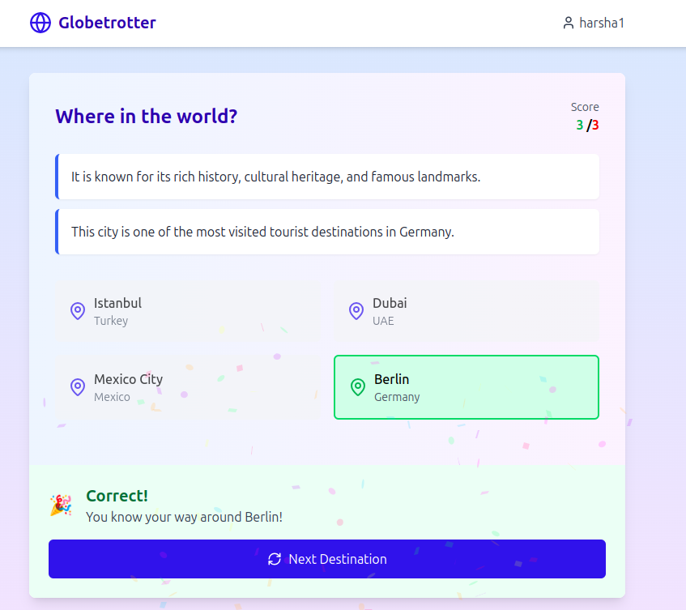

# Globetrotter Challenge



## Overview

Globetrotter Challenge is an interactive web application that tests your knowledge of world destinations. Players are presented with cryptic clues about famous places and must guess which destination they refer to. After guessing, players unlock fun facts and trivia about the destination!

## Features

- **Destination Guessing Game**: Receive 1-2 random clues about a mystery destination and select from multiple possible answers
- **Immediate Feedback**:
  - Correct answers trigger confetti animations and reveal interesting fun facts
  - Incorrect answers provide trivia about the destination you missed
- **Score Tracking**: Keep track of your correct and incorrect answers
- **Challenge Friends**: Share your score with friends via WhatsApp and challenge them to beat it
- **User Profiles**: Create a unique username to track your progress

## Tech Stack

- **Frontend**: React, TypeScript, Tailwind CSS, Vite
- **Backend**: Node.js, Express
- **Database**: MongoDB
- **Additional Libraries**:
  - canvas-confetti: For celebration animations
  - react-router-dom: For application routing
  - axios: For API requests
  - lucide-react: For UI icons

## Getting Started

### Prerequisites

- Node.js (v14 or higher)
- MongoDB account (or local MongoDB installation)

### Installation

1. Clone the repository:

   ```
   git clone <repository-url>
   cd globetrotter-challenge
   ```

2. Install dependencies:

   ```
   npm install
   ```

3. Set up environment variables:
   Create a `.env` file in the root directory with the following variables:

   ```
   MONGODB_URI=your_mongodb_connection_string
   PORT=5000
   ```

4. Start the development server:

   ```
   # Start the backend server
   npm run server

   # In a separate terminal, start the frontend
   npm run dev
   ```

5. Open your browser and navigate to `http://localhost:5173`

### Seeding the Database

To populate the database with initial destinations:

1. Start the server
2. Make a POST request to `/api/destinations/seed` (you can use tools like Postman or curl)

## Game Flow

1. **Registration**: Create a username to start playing
2. **Game Start**: Receive clues about a mystery destination
3. **Guessing**: Select from four possible destinations
4. **Feedback**: Get immediate feedback and learn interesting facts
5. **Continue**: Play again with a new destination
6. **Challenge**: Share your score with friends via WhatsApp

## API Endpoints

### Destinations

- `GET /api/destinations/random`: Fetches a random destination with limited clues
- `GET /api/destinations/options/:id`: Gets multiple choice options including the correct answer
- `POST /api/destinations/verify`: Verifies the user's answer and returns feedback
- `POST /api/destinations/seed`: Seeds the database with initial destinations (development only)

### Users

- `POST /api/users`: Creates a new user profile
- `GET /api/users/:username`: Retrieves a user's profile by username
- `PATCH /api/users/:username/score`: Updates a user's score

## Project Structure

```
globetrotter-challenge/
├── server/                  # Backend code
│   ├── models/              # MongoDB schemas
│   ├── routes/              # API routes
│   └── index.js             # Server entry point
├── src/                     # Frontend code
│   ├── components/          # Reusable UI components
│   ├── context/             # React context providers
│   ├── pages/               # Application pages
│   └── main.tsx             # Frontend entry point
├── .env                     # Environment variables
├── package.json             # Project dependencies
└── vite.config.ts           # Vite configuration
```

## Expanding the Dataset

The application comes with a starter dataset of destinations. To expand it:

1. Create a JSON file with additional destinations following the same structure
2. Use the MongoDB import tools or create a custom import script
3. Each destination should include:
   - City and country
   - Multiple clues
   - Fun facts (shown for correct answers)
   - Trivia (shown for incorrect answers)

## Deployment

### Backend

1. Set up a MongoDB Atlas cluster
2. Deploy the Node.js server to a platform like Heroku, Render, or Railway
3. Set the appropriate environment variables

### Frontend

1. Build the frontend:
   ```
   npm run build
   ```
2. Deploy the contents of the `dist` folder to a static hosting service like Netlify, Vercel, or GitHub Pages

## License

[MIT License](LICENSE)

## Acknowledgements

- Destination data sourced and expanded using AI tools
- Icons provided by [Lucide React](https://lucide.dev/)
- Background images from [Unsplash](https://unsplash.com/)
